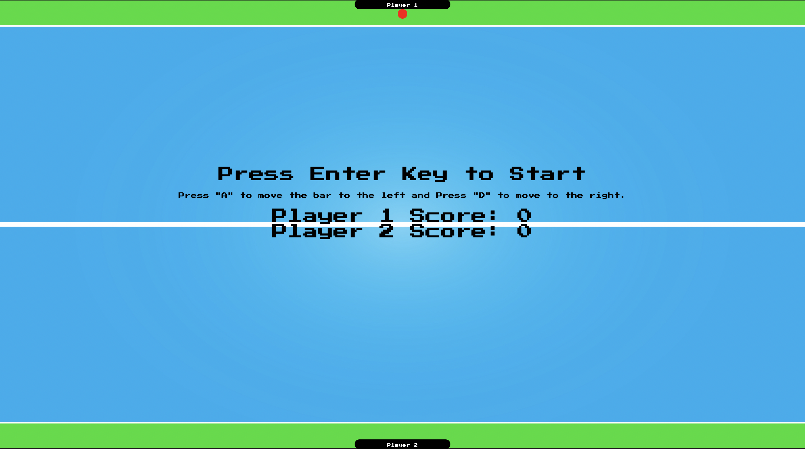

### Ping Pong Game

Welcome to Ping Pong, a simple browser-based game where two players compete to hit a ball back and forth using paddles. This README provides an overview of the files included in this project and how to play the game.

#### Files Included:

1. **index.html**: This file contains the structure and content of the game. It includes HTML elements for displaying the game board, paddles, ball, and score.

2. **style.css**: This file contains the styles to enhance the visual appearance of the game elements, such as background image, colors, fonts, and positioning.

3. **script.js**: This file contains the JavaScript code responsible for the game's logic, including ball movement, paddle controls, collision detection, score tracking, and game initialization.

#### How to Play:

1. **Starting the Game**:
   - Open the `index.html` file in a web browser.
   - Press the **Enter key** to start the game.

2. **Game Controls**:
   - Use the **A key** to move the paddle left and the **D key** to move it right.

3. **Objective**:
   - The objective of the game is to hit the ball past the opponent's paddle.
   - Each time the ball passes the opponent's paddle, the player scores a point.

4. **Winning the Game**:
   - The game continues until one player reaches the maximum score.
   - The player with the highest score wins the game.

#### Game Features:

- **Local Storage**: The game stores the maximum score and player name in the browser's local storage.
- **Alert Messages**: Alert messages provide feedback to the players, including the maximum score achieved and game instructions.
- **Game Board Reset**: The game board resets after each round, maintaining the positions of paddles and the ball.

Enjoy playing Ping Pong! If you have any questions or feedback, feel free to reach out to me via email at panwarvishakha31@gmail.com or connect with me on LinkedIn https://www.linkedin.com/in/vishakha-panwar-55a84114b/. I'm open to collaborations, job opportunities, or just a friendly chat!

Thank you!